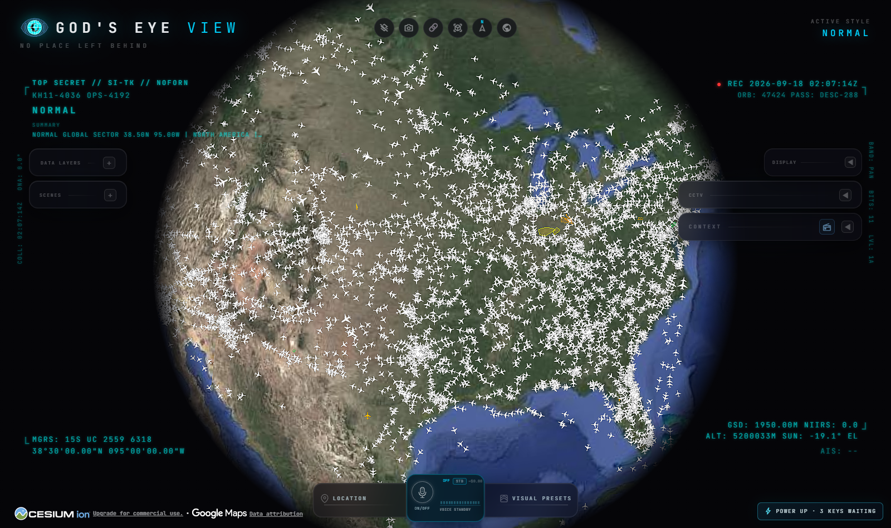
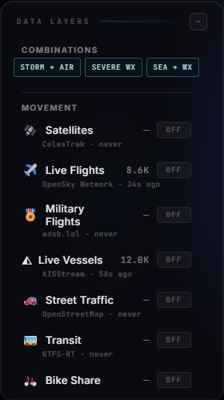
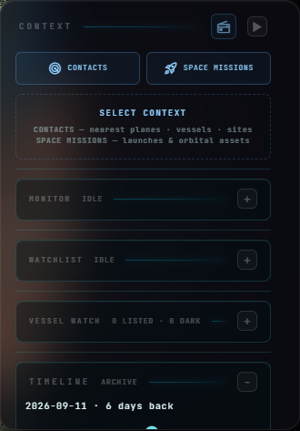
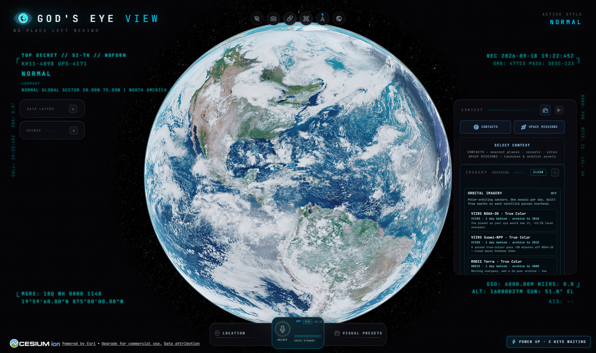
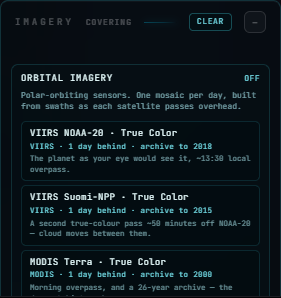
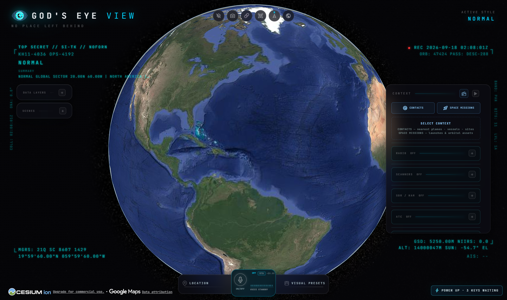
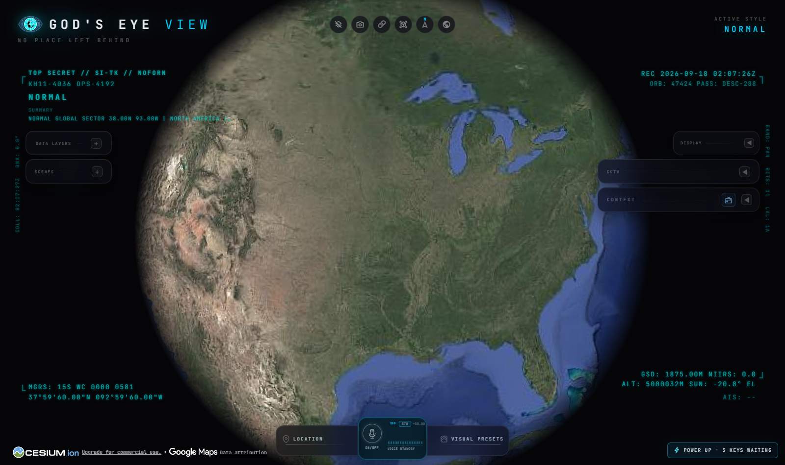
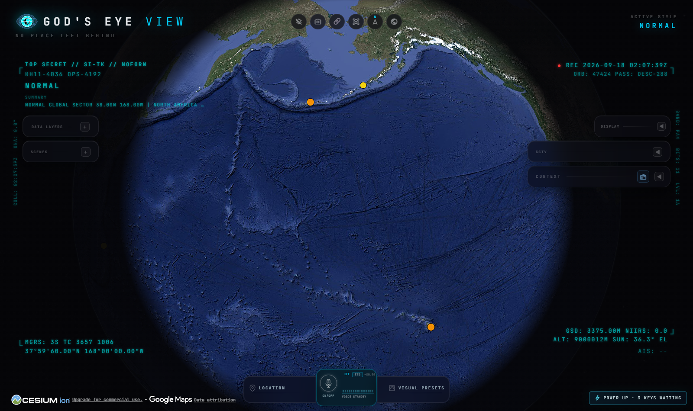

<div align="center">

# 🌐 God's Eye View

[](https://github.com/jmtibbetts/gods-eye-view/actions/workflows/ci.yml)

### A spy-satellite simulator in your browser — then you realize the sources are public and the data is real.

Photorealistic 3D globe. Live aircraft, ships, satellites, earthquakes, traffic, and public cameras. Hands-free voice control powered by a realtime AI agent.

_No place left behind._

🛠️ **This fork adds** live police / fire / EMS scanners · web SDR receivers · ATC frequencies · NWS weather alerts · SPC storm reports and convective outlooks · USGS volcano alerts · 41 switchable satellite sensors · a SENSORS panel that follows an imaging satellite and switches its bands · a LAUNCH panel with live countdowns, webcasts, the range radio, the FAA's launch closures and a T−10 reminder · FAA flight restrictions · SOCRATES conjunctions · tropical cyclone tracking · river flood gauges · drought · EPA air quality · NOAA space weather (aurora oval, Kp, alerts) · aviation SIGMETs · GOES lightning · SatNOGS ground stations · GDELT conflict reporting · the NASA ISS live stream · region monitors · contact watchlists · sanctioned-and-dark ship detection · an imagery timeline · snapshot export — **[see what's new →](#-what-this-fork-adds)**


<a href="https://www.youtube.com/@bilawalsidhu">
  
</a>

▶️ **From the project behind the viral God's Eye View series** _(formerly WorldView)_ — [5M+ on YouTube](https://youtube.com/playlist?list=PL6qSg2I-7_koPbDnSMo0QeeHX_RknA2uv&si=nBGYMoHWQw41v93Q) · [25M+ across socials](https://www.google.com/search?q=god%27s+eye+view)

[](https://x.com/bilawalsidhu/status/2093798887815348521)

🏆 **Reached #1 on GitHub Trending, daily and weekly · August 2026**

**[#8 Product of the Day](https://www.producthunt.com/products/god-s-eye-view?launch=god-s-eye-view)** · Hunted by Chris Messina, creator of the hashtag

_“pretty cool”_ — [Brendan Eich](https://x.com/BrendanEich/status/2094592096401490266), creator of JavaScript and co-founder of Mozilla and Brave · Featured on **[Pinokio](https://pinokio.co/posts/01m1m4p9xxm3qw7dnnpj2wr93g)**

⚡ **Start without API keys.** Install with [Pinokio](https://pinokio.co/apps/github-com-bilawalsidhu-gods-eye-view) or run locally from the terminal. Add optional keys inside the app. **[→ Quick Start](#-quick-start)**

</div>

---

<div align="center">

**[Quick Start](#-quick-start) · [First Five Minutes](#-the-first-five-minutes) · [Talk to It](#-talk-to-it) · [What's Live](#-whats-on-the-globe) · [Under the Hood](#-under-the-hood) · [Keys & Costs](#-api-keys)**

</div>

---

## 🆕 What This Fork Adds

This is [**jmtibbetts/gods-eye-view**](https://github.com/jmtibbetts/gods-eye-view), a fork of [bilawalsidhu/gods-eye-view](https://github.com/bilawalsidhu/gods-eye-view). Everything above and below is the upstream project; this section is what has been built on top of it — eighteen new data layers and six new tools, all keyless.

**Listen to the world**

| Added | What it does |
| ----- | ------------ |
| 🚨 **Scanners** | Live police, fire and EMS radio — 460+ trunked systems across the US, Canada and Australia, playing back like a desk scanner. Where OpenMHz has no local system, it links that state's Broadcastify feeds instead of showing an empty map |
| 📡 **SDR Receivers** | 1,300+ public web SDRs with bands and antennas. Pick a band, press LISTEN, and the nearest receiver that covers it opens in a window on the map — waterfall and all |
| 🛫 **ATC** | 13,600 airports with published tower/ground/approach/ATIS frequencies and 700+ Center sites. **FOLLOW PLANE** retunes Ground → Tower → Approach → Center as the selected aircraft moves |
| 📡 **SatNOGS** | The open ground-station network that actually receives satellites — ~4,500 volunteer antennas, from the few dozen connected right now out to every station on file. Every other satellite layer shows where a spacecraft is; this one shows where somebody is listening |

**Watch the weather and the ground**

| Added | What it does |
| ----- | ------------ |
| 🌩️ **Weather Alerts** | Active NWS watches and warnings as severity-coloured polygons, clickable for headline, instructions and expiry |
| 🌪️ **Storm Reports** | Preliminary NOAA SPC tornado, damaging-wind and hail reports over a rolling two days, hail sized in inches and wind in knots |
| 🌋 **Volcano Alerts** | Every US-monitored volcano above background, with the aviation colour code and the ground alert level shown side by side, because they move independently |
| 🛰️ **IMAGERY — 41 sensors** | Switch the globe between 41 products from NASA, NOAA, EUMETSAT and Copernicus, grouped by what they reveal. True colour from four platforms at four overpass times; false colour for fire and for snow-against-cloud; the day/night band; Sentinel-1 radar that sees through cloud. The complete geostationary ring — GOES-East and West, Himawari, Meteosat, and multimission composites of the whole belt. Measured science on a colour ramp: sea-surface temperature, aerosol, snow, sea ice, flood extent. Each one states its own publication lag, and `npm run check:imagery` re-probes them all so a retired product fails loudly instead of serving a silent black tile |
| 🛰️ **SENSORS** | Track NOAA-20, Terra, a Sentinel, GOES or Himawari and the panel names the instrument it carries — swath, resolution, bands — and offers every product the globe can draw from it as a button, while the satellites layer paints the ground the sensor is sweeping under it as it moves. A geostationary imager also plays its last dozen published frames as a loop, and the panel says when the satellite is next over the ground you were looking at — and when it next images it, in daylight or not. Every picture is labelled with how far behind live it is published, because nothing outside an operator's control room commands a spacecraft |
| 💥 **Conjunctions** | The week's closest approaches from CelesTrak SOCRATES — the highest probabilities, the tightest misses and everything involving a crewed station — each drawn at the point over the Earth it will happen, with the miss distance, relative speed and SOCRATES's maximum probability stated as the screening figure it is, never as an operator's risk |
| 🌀 **Tropical Cyclones** | Active storms from the National Hurricane Center with forecast cone, track and past track — plus the disturbances NHC is watching, each with its two-day and seven-day formation odds, so the layer says something useful in the two-thirds of the year with no named storm |
| 🌀 **Weather Radar** | NEXRAD and global RainViewer precipitation mosaics, stackable under the flights diverting around them |
| ⛈️ **Severe Outlook** | SPC convective outlooks — categorical risk for days one to three plus tornado, wind and hail probabilities — drawn in SPC's own colours with the higher risk never buried under the band that encloses it |
| 😷 **Air Quality** | EPA AirNow AQI contours in AirNow's own six category colours, worst category named in the panel |
| 🌌 **Space Weather** | NOAA SWPC's OVATION aurora oval draped on the globe, with the planetary K index, the G/R/S storm scales and the alerts they issue on the layer row — labelled as the forecast it is, not tonight's sky |
| 🌊 **River Flood** | NOAA's 12,800-gauge river network, filtered to the few dozen at or above action stage, with 24/48/72-hour forecast horizons — and an honest blank where a gauge's reading and its own thresholds disagree by orders of magnitude |
| 🏜️ **Drought** | US Drought Monitor conditions D0–D4 and CPC's monthly and seasonal outlooks, in the services' own colours, each readout carrying the date it describes because a week-old drought map read as "today" is the mistake this product invites |
| ⚠️ **Aviation Hazards** | Every SIGMET in force — volcanic ash by volcano name, thunderstorms, turbulence, icing, tropical cyclone, mountain wave — with flight levels and validity, international and US domestic feeds merged, expired advisories dropped |
| ⛔ **Flight Restrictions** | Every FAA temporary flight restriction in force as the polygon it closes — space operations, hazards, security, VIP, events — with the NOTAM's own start, end and altitude block for the launch closures, and the day named on the list for the rest, each labelled as which it is |
| ⚡ **Lightning** | Individual flashes from the GOES Geostationary Lightning Mappers, a new file every twenty seconds, keyless from NOAA's open-data buckets. Western Hemisphere only, and the panel names which satellites reported so an unobserved Europe is not read as a quiet one |

**Watch the world**

| Added | What it does |
| ----- | ------------ |
| 📰 **Conflict Reporting** | Where violence is being *reported* — GDELT's machine-coded event counts shaded by country, never as points, because GDELT places a third of its events on a state or country centroid. Every card says the data is news-derived and unverified, and what share of that country's events carried no real location |
| 🛰️ **ISS Live** | One chip on the satellites row opens NASA's live stream from the station in the receiver dock. Called a stream, not a camera: HDEV was decommissioned, and what NASA streams now alternates external views with mission coverage |

**Make sense of it**

| Added | What it does |
| ----- | ------------ |
| 🚀 **LAUNCH** | The next launches as live countdowns — WATCH opens the operator's webcast in the receiver dock, FLY TO PAD puts the camera on the pad with the clock over it, and LISTEN names what a radio near the range can actually hear: the range's own trunked system on OpenMHz, the tower and approach frequencies of the airfields under the closure, and the nearby web receivers, with the ones that cannot hear a launch labelled as such |
| 🎯 **MONITOR** | Draw a watch circle anywhere and every enabled layer reports what is inside it, flagging new arrivals as they appear |
| 📌 **WATCHLIST** | Pin an aircraft callsign or ICAO24, or a vessel MMSI or name, and it turns green the moment that contact shows up on any layer |
| 🚢 **VESSEL WATCH** | Which ships in view are on the OFAC sanctions list — matched by MMSI, never by name — and which tracked ships have stopped transmitting |
| 🕰️ **TIMELINE** | Scrub daily satellite imagery back through a fortnight of archive, or press PLAY and watch it run forward |
| 🧩 **Layer combinations** | One press stacks the layers that only work together, like radar under live flights |
| 📸 **Snapshot** | One click saves the current view as a captioned PNG stamped with coordinates and UTC time |



_**STORM + AIR** in one press: NEXRAD radar under the live fleet with active NWS warnings on top. Screenshots throughout this README are live captures, reproducible with `node scripts/capture-readme-shots.mjs`._

Every addition is keyless, unit tested, and documented in the sections below — the layer table lists them alongside the original layers, and the capability list covers the tools.

---

## 🌍 Why This Exists

God's Eye View brings public signals into one explorable globe. Track the world live. Talk to it. Break it. Extend it.

Flight transponders, ship beacons, orbital elements, seismographs, and public cameras already tell us a lot about the world. God's Eye View puts them in the same place, so you can move between a global picture and an individual aircraft, ship, or street. It runs locally in your browser, with source code you can inspect and extend.

> Half the magic is that it looks like a forbidden cockpit. The other half is that every line of code is inspectable.

Most feeds are live or regularly refreshed. Traffic is simulated along real
roads using aggregate location data. CCTV camera poses and rocket launch
trajectories are coarse estimates.

Start with the included data sources, then add your own. Each layer is a separate module.

---

## 🎛️ What This Thing Does

- **🛩️ Cockpit view:** Ride inside a tracked flight — the camera holds the terrain under you all the way down.
- **📡 Contacts:** A 250 km roster of everything near your target — step through live aircraft and drop into any cockpit.
- **🎯 Click-to-track anything:** Camera locks on, draws a fading trail, surfaces full metadata — and a tracked fire or vessel hands you off to the nearest live camera in one click.
- **🖊️ Voice whiteboard:** Speak annotations onto the world — real boundary polygons, marks, and routes.
- **🛫 3D hangar:** Real per-class aircraft models — 787, ATR-72, Citation, Bell 206, MQ-9 — and a tracked contact swaps from glyph to 3D model as you close in.
- **🎨 Reskin reality:** GLSL sensor looks over the normal globe — CRT, NVG, FLIR/thermal, Noir, Snow.
- **🟩 Detection overlay:** Screen-space bounding boxes and IDs on everything in view.
- **🎖️ Military HUD:** Tactical heads-up display with intelligence-style telemetry.
- **🌐 Global Context:** Stage the full situational picture with one switch — and get your exact view back when you leave.
- **🧩 Layer combinations:** One press stacks the layers that only make sense together — STORM + AIR puts NEXRAD radar under live flights with active warnings, so you can see what the traffic is actually diverting around. Press again to put it back.
- **🛰️ IMAGERY — 41 sensors, one globe:** The same planet through forty-one instruments, grouped by what each actually reveals. True colour from four platforms at four overpass times. False colour where shortwave infrared separates burning fire from old burn scar, and ice from the cloud sitting on top of it. The day/night band, which sees last night by its own light — cities, gas flares, fishing fleets. Sentinel-1 radar, which makes its own illumination and so sees ground through cloud and at night. The complete geostationary ring, with no blind side: both GOES, Himawari, Meteosat over Europe and Africa, the Indian Ocean service, and multimission composites of the entire belt in one frame. Measured science on a colour ramp: sea-surface temperature and its anomaly, aerosol, snow cover, land temperature, sea ice, flood extent. And with a free Copernicus key, Sentinel-2 at 10 m — individual buildings, field boundaries, single vessels. Every sensor states the lag it is actually running at, because a ten-minute geostationary frame and a three-day snow composite are not the same claim, and presenting them identically as "satellite imagery" would be the one lie this feature could tell.
- **🛰️ SENSORS — ride an imaging satellite:** Track NOAA-20 and a green strip three thousand kilometres wide runs back along its ground track — the ground VIIRS has just swept. Track GOES-East and the disk it stares at from 75°W is drawn under it. The SENSORS panel names the instrument, its swath, resolution and bands, and lists every product this app can draw from that platform as a button: press one and the globe switches to it, so the picture the satellite is laying down and the dot laying it down are on screen together. The polar imagers arrive with the catalog — CelesTrak's weather and resource groups, tagged EARTH OBS in the legend — and with nothing tracked the panel lists the fleet with a TRACK button each, because finding NOAA-20 among a thousand dots by eye is not a reasonable ask. What it will never offer is a way to point the camera: no public satellite takes commands from anyone but its operator, and every product is published on the instrument's own schedule, minutes for geostationary and a day for polar, which the panel states outright rather than letting a published mosaic pass as a live view.
- **🌀 Tropical cyclones, and what might become one:** Active storms with intensity, pressure, motion and the forecast cone — and, because NHC answers "there are no tropical cyclones at this time" for most of the year, the Tropical Weather Outlook alongside them. Every storm card says what the cone actually means: the likely track of the centre, about two times in three, saying nothing about how wide the storm is or how far its hazards reach. It is the most misread object in public weather graphics.
- **🌌 Space weather:** NOAA SWPC's aurora oval draped on the globe — the OVATION forecast, drawn as ground cells from the green of a quiet arc to the red of a storm so it sits on Google 3D as well as the plain globe — with the planetary K index, the G storm scale and the R and S scales on the layer row, and the last day's alerts under them. Every number is labelled as what SWPC calls it: a forecast about half an hour ahead with its observation and forecast times, not a sighting; a three-hourly index with its time; a now-cast. The R scale is there for the radio user, because an R2 blackout is why the HF bands under the web receivers went quiet.
- **🕰️ TIMELINE:** Scrub the daily satellite imagery back through a fortnight of archive, or press PLAY and watch the last two weeks run forward. It moves only the feeds that actually have an archive and names them, so it never implies it is rewinding live aircraft or radar.
- **🚢 VESSEL WATCH:** Two reads the raw AIS feed does not give you — which ships in view are on the OFAC sanctions list, matched by MMSI and never by name, and which tracked ships have stopped transmitting. Both are stated with their limits: a listing without an MMSI cannot be matched, and a coverage gap is not proof a transponder was switched off.
- **📌 WATCHLIST:** Pin the contacts you actually care about — an aircraft callsign or ICAO24 address, a vessel MMSI or name — and each one turns green the moment it appears on any enabled layer, wherever on Earth it is, with a toast and a FLY TO.
- **💥 Conjunctions — where the close calls will be:** CelesTrak's SOCRATES screens the whole public catalog against itself eight times a day and lists every pair coming within five kilometres in the next week — a hundred and fifty thousand of them, most of them Starlink passing Starlink. The proxy reads that file on SOCRATES's own cadence and keeps the few dozen worth a look: the highest collision probabilities, the closest misses, and anything involving the ISS, Tiangong or the vehicles flying to them. Docked pairs (a Soyuz on the station reads as probability one at no relative speed) are set aside, and the station's several catalog numbers are folded into one. Each kept pair is placed by propagating both objects' elements to the time of closest approach — debris is in no catalog group the satellites layer loads, so the proxy fetches elements one object at a time and the row says how many are still on their way — and drawn as a marker on a stalk to the ground, sized and coloured by probability band, with chips for the high band and the crewed ones. Every card calls the number what it is: SOCRATES's maximum probability from public elements, a screening figure and not an operator's assessment, and a probability of one is usually a stale element set rather than a collision.
- **🚀 LAUNCH — watch it go, hear the range:** The next dozen launches from Launch Library 2 as live countdowns, in flight, on hold or flown, with the operator's latest note under each. WATCH opens the webcast in the receiver dock when the publisher allows framing and on their own page when they do not; FLY TO PAD puts the camera on the pad with the clock hanging over it, so the count, the pad and the stream are on screen together. LISTEN is the honest part. The countdown net and the flight loops you hear on a webcast are the operator's own circuits, mixed into their stream — no public receiver hears them, and this panel never pretends one does. What a radio near the range CAN hear, it names: the Kennedy Space Center trunked system that OpenMHz carries, a clip per transmission; the tower and approach frequencies of the strips on the range and the airfields under the closure, which LiveATC opens in its own tab; and the web receivers nearby, with every HF-only KiwiSDR marked as unable to hear a launch rather than offered as a way in. RANGE is what is published around the pad: the FAA's space-operations closures within 250 km with the NOTAM's own start, end and altitude — a closure opens hours before the window and is often the firmest public sign of when the operator means to fly — and SHOW turns on Flight Restrictions and flies to it; and the droneship the booster is coming back to, named when Launch Library names it and otherwise the ships that work that coast, one WATCH from the WATCHLIST with Live Vessels switched on — pinned by MMSI, because the barges broadcast their hull names (MARMAC 304, not "Of Course I Still Love You"). ALERT T−10 is a browser notification ten minutes before net, for the launch you would otherwise miss with the tab in the background; it asks for permission once and falls back to a toast when refused.
- **⛔ Flight restrictions:** Every FAA TFR in force, drawn as the polygon it closes and coloured by kind — space operations on top, then hazards, security, VIP and events — with chips to show one kind alone. The launch closures carry the NOTAM's own start, end and altitude block to the minute, fetched from the FAA's detail page; the rest carry the day their list title names, and every card says which it is rather than letting a calendar day read as a time. A closure still ahead is drawn hollow, in force is drawn filled, and the FAA's own page for the NOTAM is one click away.
- **🎯 MONITOR watchboxes:** Draw a watch circle over anywhere on Earth and every enabled layer reports what is inside it — aircraft, vessels, fires, scanners, storm reports — with new arrivals flagged as they appear.
- **🎥 Scene director:** Capture cinematic camera tours for clips and demos.
- **📸 Snapshot:** One click saves the current view — globe, overlay labels and all — as a captioned PNG stamped with coordinates and UTC time.
- **🔗 Share Links:** Camera, style, layers, and even one tracked target serialize into a URL — a live target is a handoff, not a bookmark.
- **🏠 Reset Globe:** One control — or one sentence — back to the full Earth.



_Combinations sit above the layer groups. Press one to fill in whatever is still off; press it again to turn the whole set back off, so trying one costs nothing._



_The analysis panels ride in the Context rail beside the radio stack: **MONITOR** watch circles, the **WATCHLIST** of pinned contacts, **VESSEL WATCH** for OFAC-listed and gone-dark ships, and the **TIMELINE** scrubber._



_GOES-East GeoColor over the Americas — true colour by day, infrared cloud and city lights by night, refreshed every ten minutes. The IMAGERY panel on the right is what else that globe could have been._



_Each sensor says what it is, how far behind live it runs, and how far back its archive goes, so nothing here is presented as more current than it is. Imagery draws on the 2D globe, so turning a sensor on sets the photorealistic 3D basemap aside and CLEAR brings it back — the panel says so rather than letting it read as a bug._



_TIMELINE scrubbing daily VIIRS true-colour back through a fortnight of archive. It moves only the feeds that have an archive and names them — live feeds always show now and are never rewound._

---

<div align="center">

[](https://www.youtube.com/watch?v=GRJaKcXZS94)

▶️ **[The full walkthrough of everything below, on YouTube](https://www.youtube.com/watch?v=GRJaKcXZS94)**

</div>

## ⚡ Quick Start

**Start without an account or API keys.** Both paths open the same app with
Esri satellite imagery and keyless terrain. OSM is the fallback if Esri is
unreachable. Flights, military traffic, satellites, earthquakes, public
cameras, radio, police/fire/EMS scanners, web SDR receivers, ATC, and launches
are available without keys.

For photorealistic 3D, add a **Cesium ion token** for eligible personal,
non-commercial use, or a **Google Maps key** for the direct, metered route and
in-app place search. Provider terms and quotas apply. Add keys through the
app's **POWER UP** panel; [Keys & Costs](#-api-keys) explains the options.

### Path 1 — One click, no terminal

1. Install or update [Pinokio](https://desktop.pinokio.co/) to **8.2 or later**.
2. Open [God's Eye View in Pinokio](https://pinokio.co/apps/github-com-bilawalsidhu-gods-eye-view).
3. Click **Install**, then **Start**.

Available on **Windows, macOS, and Linux**. The Pinokio maintainer reports
cross-platform testing of the fixed installer. The launcher installs the
locked dependencies, finds a free local port, and opens the app.

**Tried before and installation failed?** Update Pinokio and try again.
Version 8.2 fixes the launcher installation issue;
[details from the Pinokio maintainer](https://pinokio.co/posts/01m1m4p9xxm3qw7dnnpj2wr93g).

### Path 2 — Terminal / coding agent

Use **Node.js 24.x (24.14.0 or later) or 26.x**. The setup doctor warns about
Node 25, which is end-of-life.

```bash
git clone https://github.com/bilawalsidhu/gods-eye-view.git
cd gods-eye-view
npm ci
npm run doctor
npm run dev
```

Open **`http://localhost:4173`**. Choose **Live Contacts**, **Space Missions**,
**Environmental**, or **Explore Manually** from the first-run panel.

<details>
<summary>Startup performance</summary>

A point-in-time M5/Chrome capture measured a median 1.86-second cold start.
This is a comparison baseline, not a guarantee for your machine or connection.
See [docs/PERFORMANCE.md](docs/PERFORMANCE.md).

</details>

**macOS shortcut:** `./scripts/dev-fresh.sh` clears the Vite cache and pulls any
configured keys straight from the Keychain. It starts keyless too.

### Then power it up — in the app, not in a file

Keys are upgrades, not prerequisites. When you want one, click the **POWER UP**
chip in the bottom-right corner: Provider Settings lists every supported key,
what it switches on, and where to get it. Paste, hit **SAVE KEYS**, and the app
restarts itself with the new capability on. Once everything is configured the
chip reads **POWERED UP** — and if a compact layout hides it, `?setup=1`
reopens the same panel.

- **Where keys land:** Pinokio → the app's ignored `pinokio/ENVIRONMENT`; a
  terminal clone → the repo-root `.env`. Either file is made owner-only
  _before_ a secret is written into it. These are local plaintext files,
  excluded from Git; the app uses your keys to contact the providers.
- **Keys you already have stay yours:** values from your shell or the macOS
  Keychain show as _configured externally_ and are read-only to the panel.
- **What to get first:** the free [Cesium ion](https://cesium.com/ion) token
  (eligible personal, non-commercial use; current terms and quotas apply) for
  photorealistic 3D and world terrain; a Google Maps key only for the
  billing-enabled, metered route + place search; OpenAI when you want to talk
  to the world. Full map, costs included, in [Keys & Costs](#-api-keys).

<details>
<summary>Older Pinokio versions and credential storage</summary>

Do not enter credentials in Pinokio 8.0.40's native **Configure** panel: that
release does not save this nested app file correctly, and it logs submitted
values. Use **POWER UP → Provider Settings** inside GEV instead. The Pinokio
8.2 announcement fixes installation; it does not establish that this separate
Configure issue is resolved. On macOS, the Keychain via
`./scripts/dev-fresh.sh` remains the stronger storage option.

</details>

The server binds to **localhost** on both paths, and Provider Settings answers
requests only from your machine. Browser-side keys (Google Maps, Cesium ion)
must be restricted at their providers — [SECURITY.md](SECURITY.md) shows how,
and it carries the LAN-sharing rules alongside [Keys & Costs](#-api-keys).

---

## 🕐 The First Five Minutes

Choose a first-run mission, or try these in order. The GIFs show Google Photorealistic 3D; your starting basemap depends on the keys you've added.

1. **Light up the sky.** Take the **Live Contacts** mission (or turn on **Flights** yourself) — thousands of live aircraft, gliding on real telemetry, detection mesh already reading the scene. Click one: the camera locks on, a trail draws behind it, and its live telemetry card comes up.
2. **Take the controls.** Hit **COCKPIT** on your tracked plane and ride it down, switching sensors mid-flight: NVG into Ironbow FLIR.


3. **Drop into a busy airport.** Search one and descend to the taxiways with **3D** aircraft on — grounded contacts, taxi trails, the whole apron working in real time.


4. **Look through a public camera.** Turn on **CCTV** over Austin, London, California, or Finland. The feeds aren't webcam embeds — they project _into_ the 3D city. Cycle coverage to **VIEWSHED** and every camera draws its estimated coverage volume — where it reaches, and where it goes blind.


5. **Track something in orbit.** Turn on **Satellites** and click the ISS — you ride along at orbital distance, orbit ring and all.


6. **Switch the optics.** Tap `1`–`7` — CRT, NVG, FLIR — and the whole live planet re-renders through a different sensor.


7. **Talk to it** _(needs an OpenAI key)_: _"Take me to LAX and select the nearest airborne aircraft."_
8. **Come home.** Hit **Reset Globe** — or just say _"zoom out to a globe view."_

**Keyboard:** `1`–`7` visual styles · `H` HUD · `D` detection · `C` cockpit · `Esc` out.

---

## 🛩️ The Cockpit

> Every plane should let you do this.

Real-time cockpit mode, built from live flight data: the camera rides your contact with real terrain holding underneath, all the way down — sensor styles come along for the ride, and **Contacts** keeps the 250 km roster one click away: jump plane to plane and fall straight into the next cockpit.


The cockpit even carries its own briefing strip: nearby live signals, regional headlines, and real local weather — with an opt-in **WX** mode that renders volumetric clouds from actual observations around your aircraft.


_Why cockpit mode exists: you're riding a real aircraft over real terrain — and you get to pick which sensor you see the world through._

---

## 🎙️ Talk to It

> Voice needs an **OpenAI key**. Without one the entire app still runs — the mic button just reports voice is unavailable. The same key drives the **AI HUD summary**: a terse, five-word intelligence-style readout of the current view that regenerates as you move.

Click **GEV MIC**, grant the microphone, and just talk. This is more than a voice-controlled remote:

- **🧠 It knows what it's looking at.** The agent pulls live scene context before answering — including coordinates, street names, active layers, and view scale. Ask _"what city is this?"_ mid-flight and it knows.
- **🎯 Entity Q&A.** Click any plane, ship, or datacenter and ask _"what's this?"_ It answers using the object's live telemetry.
- **👁️ Visual grounding.** At street level, it reads a viewport screenshot to identify legible signage and building names, and is instructed never to hallucinate labels.
- **🎬 Cinematic framing.** _"Show me the planes overhead"_ pulls the camera back, angles it, and frames the live traffic like a director.
- **🔒 Honest and secure.** The agent only confirms actions that succeeded. Your `OPENAI_API_KEY` never touches the browser; the client only gets a short-lived session token.

Twenty-eight tools, four jobs — the commands below come straight from the product's voice test suite and tool playbook:

**🎥 Direct it** — drone-operator camera verbs:

> 🗣️ _"Take me to Tokyo."_ · _"Orbit around this area slowly."_ · _"Draw the walking route from the Capitol to Zilker Park."_ → _"Fly the route we just drew."_ · _"Zoom out to a globe view."_

**🖊️ Annotate it** — a whiteboard over the real world:

> 🗣️ _"Outline the state of Texas."_ · _"Annotate the Texas State Capitol and its grounds"_ — it draws the **actual enclosing boundary**, not a circle. · _"How far is the Eiffel Tower from the Louvre?"_ — a connector arrow appears and it speaks the distance. Everything persists until you say _"clear the map."_

**✍️ Or draw it yourself** — DISPLAY ▸ **Draw**: pick Area, Line or Pin, click the vertices on the real world, double-click to finish, label it. Same whiteboard, same persistence, no microphone needed.


**🔎 Interrogate it** — analyst queries against the live layers:

> 🗣️ _"How many flights are over Texas right now?"_ · _"Which ships are headed to Oakland?"_ · _"What is the biggest fire near Los Angeles?"_ · _"Is anything flying above forty thousand feet?"_ · _"When does the ISS pass over next?"_

**🎛️ Operate it** — the whole console, hands-free:

> 🗣️ _"Switch to night vision and turn on the flights layer."_ · _"Turn on the camera viewsheds."_ · _"Play a news radio station near Austin."_ · _"Track that plane."_ → _"Enter Cockpit."_

**And the rapid-fire tier** — one sentence each:

> 🗣️ _"Show me global infrastructure."_ (stages the layers and pulls back to the globe) · _"Play Orbital Watch."_ (a full cinematic scene) · _"Set detection density to fifty percent."_ · _"Next contact — helicopters only."_ (mid-cockpit) · _"Show me space missions."_ · _"Switch to OSM."_ · _"Sharpen the image a touch."_ · _"Switch to the tactical layout."_ · _"What's turned on right now?"_


_Ask for radio near anywhere and the globe starts broadcasting — every station is a real place you can fly to._

---

## 🛰️ What's on the Globe

Thirty-one layers and map sources. **Twenty-nine have a keyless path.** Some offer additional capabilities with a provider key. (🟢 no key · 🟡 free key · 🔴 metered.)

| Layer                       | What you get                                                                                                                                                                                                                                                                                                                                                                        | Source                                  | Auth                                                                                                |
| --------------------------- | ----------------------------------------------------------------------------------------------------------------------------------------------------------------------------------------------------------------------------------------------------------------------------------------------------------------------------------------------------------------------------------- | --------------------------------------- | --------------------------------------------------------------------------------------------------- |
| 🗺️ **Map Stack**            | Esri satellite imagery, Google Photorealistic 3D, OSM, plus additional ion-hosted stacks                                                                                                                                                                                                                                                                                            | Esri / Google / Ion / OSM               | 🟢 Esri satellite + OSM · 🟡 ion-hosted Google 3D + world terrain · 🔴 direct Google + place search |
| ✈️ **Live Flights**         | 11,000+ live aircraft + route history                                                                                                                                                                                                                                                                                                                                               | OpenSky + adsb.lol                      | 🟢 (🟡 optional for more polling credits)                                                           |
| 🎖️ **Military Flights**     | ADS-B military traffic in amber                                                                                                                                                                                                                                                                                                                                                     | adsb.lol                                | 🟢                                                                                                  |
| 🚢 **Live Vessels**         | Thousands of ships worldwide                                                                                                                                                                                                                                                                                                                                                        | AISStream                               | 🟡                                                                                                  |
| 🛰️ **Satellites**           | ~1,040-object catalog — stations, the Earth-observation fleet, visual, GNSS and the GEO belt — color-coded by class with a live legend; the **DENSE** chip drops in the whole Starlink shell, and tracking an imager draws the ground its sensor is sweeping                                                                                                                       | CelesTrak                               | 🟢                                                                                                  |
| 🌍 **Earthquakes**          | Global seismic activity, last 24h                                                                                                                                                                                                                                                                                                                                                   | USGS                                    | 🟢                                                                                                  |
| 🌋 **Volcano Alerts**       | Every US-monitored volcano currently above background, from the observatory that watches it — with both hazard scales side by side, because they move independently: the aviation colour code is the ash threat to aircraft, the ground alert level is the threat on the ground. Positions come from a bundled Smithsonian volcano-number lookup, since the USGS feed carries no coordinates                                              | USGS Volcano Hazards Program            | 🟢                                                                                                  |
| 🌩️ **Weather Alerts**       | Live NWS watches and warnings as severity-coloured polygons — tornado, severe thunderstorm, flash flood and the rest — each clickable for its headline, instruction text and expiry. Zone-only advisories ship no geometry in the feed, so they are counted rather than drawn and the panel says which is which                                                                    | US National Weather Service             | 🟢                                                                                                  |
| 🌪️ **Storm Reports**        | Preliminary tornado, damaging-wind and hail reports filed by NWS offices, over a rolling two-day window and colour-coded by kind — hail sized in inches, wind in knots, with the spotter's own comments. Marked preliminary on every card, because SPC revises and removes them during review                                                              | NOAA Storm Prediction Center            | 🟢                                                                                                  |
| 🛰️ **IMAGERY (41 sensors)** | Four switchable slots, stackable. ORBITAL: true colour from NOAA-20, Suomi-NPP, Terra and Aqua; false colour for fire and burn scars and for ice against cloud; the VIIRS day/night band; Sentinel-1 terrain-corrected radar at zoom 12; the Black Marble composite; and with a Copernicus key, eight Sentinel-2 products at 10 m. GEOSTATIONARY — the complete ring: GOES-East and GOES-West GeoColor and clean IR, Himawari visible and IR, Meteosat Third Generation GeoColor and true colour, the Indian Ocean service, SEVIRI volcanic ash, plus dust, fire-temperature and air-mass composites and two multimission frames covering the whole belt at once. MEASURED SCIENCE: sea-surface temperature and anomaly, aerosol optical depth, snow cover, land-surface temperature, sea ice, and Sentinel-1 flood extent. Each product carries its verified publication lag and archive depth — Terra reaches back to February 2000 — and `npm run check:imagery` re-probes every one, following the sun for daylight-only bands so night is never reported as a fault | NASA GIBS + EUMETSAT + RainViewer (+ Copernicus) | 🟢 (🟡 optional for Sentinel-2) |
| 🌀 **Tropical Cyclones** | NHC active storms — category, sustained wind in knots and mph, pressure, motion, advisory number — with forecast cone, forecast track and past track from NOAA's tropical map service. Draws the Tropical Weather Outlook too, since NHC reports no cyclones for most of the year: each watched area carries its two-day and seven-day formation odds. Every storm card states what the cone means, because it is the most misread object in public weather graphics | NOAA National Hurricane Center | 🟢 |
| ⛈️ **Severe Outlook** | SPC convective outlooks: categorical risk for days one to three, and the day-one tornado, wind and hail probabilities, as risk-area polygons in SPC's own colours. Nested bands are drawn with their holes punched out so a higher category is never painted over by the lower one that encloses it. Where SPC drew nothing the panel repeats SPC's own words — "Less Than 2% All Areas" is an assessment, not missing data | NOAA Storm Prediction Center | 🟢 |
| 😷 **Air Quality** | EPA AirNow AQI contours, in the six category colours AirNow publishes and asks not to be changed, with the worst category present named in the panel | EPA AirNow | 🟢 |
| 🌌 **Space Weather** | The OVATION aurora oval as ground-classified cells (so it sits on Google 3D too), Kp, the G/R/S scales and the last day's alerts | NOAA SWPC | 🟢 |
| 🌊 **River Flood** | NOAA NWPS river gauges at or above action stage — observed now, or the 24, 48 and 72-hour forecast stage, on chips — in NOAA's four flood statuses and colours. A handful of gauges publish a stage in one datum and their thresholds in another; those keep NOAA's status and their place on the map but withhold the derived "feet above flood stage", which would otherwise read as a confident, specific, wrong number | NOAA National Water Prediction Service | 🟢 |
| 🏜️ **Drought** | US Drought Monitor D0–D4 conditions, and CPC's monthly and seasonal outlooks, on chips. Polygons are generalized server side to about a kilometre and parts below that resolution dropped, with the count shown — country-wide fills under crisp coastlines would imply precision the numbers do not have | US Drought Monitor · NOAA Climate Prediction Center | 🟢 |
| 📡 **SatNOGS** | Volunteer satellite ground stations — connected now, heard in 24 hours, heard in 30 days, or every station on file — with bands, observation counts and success rate. State comes from the underlying fields, because SatNOGS reports "Offline" for stations that are connected but not accepting scheduling | SatNOGS Network (CC BY-SA 4.0) | 🟢 |
| ⚠️ **Aviation Hazards** | SIGMETs in force, by class: volcanic ash (named by volcano), thunderstorms, tropical cyclone, turbulence, icing, mountain wave. International and US domestic feeds merged into one record; expired advisories dropped and counted; multi-area advisories drawn as every area rather than their first | NOAA Aviation Weather Center | 🟢 |
| ⛔ **Flight Restrictions** | FAA TFRs in force as polygons, by kind: space operations, hazards, security, VIP, events. The list, the shapes and — for space operations — the NOTAM detail page merged server side into one record per NOTAM; multi-area NOTAMs drawn as every area; times marked exact or day-level, never passed off as the other | FAA Graphic TFRs | 🟢 |
| ⚡ **Lightning** | Every optical flash the GOES-19 East and GOES-18 West lightning mappers detected in the last minute, from NOAA's open-data buckets with no key and a new file every twenty seconds. Coverage is the Western Hemisphere, and the panel names the satellites that reported rather than only counting flashes | NOAA GOES Geostationary Lightning Mapper | 🟢 |
| 📰 **Conflict Reporting** | GDELT violent-event counts from the last fifteen-minute update, shaded by country and never drawn as points: a third of GDELT's events sit on a state or country centroid, which as markers would put a conflict in the empty middle of Nevada. Each readout says the data is machine-coded from news, not verified, and what share of that country's events carried no real location | GDELT Project | 🟢 |
| 🚗 **Traffic**              | Simulated vehicles on OSM roads. With TomTom, live flow speeds drive the simulation and congestion colors below ~8 km; individual vehicle positions are not live observations                                                                                                                                                                                                       | TomTom + OSM                            | 🟢 simulation · 🟡 live flow speeds                                                                 |
| 📹 **CCTV Mesh**            | ~3,600 public cameras projected _into_ the 3D space — Austin · Texas (TxDOT) · California (Caltrans) · London (TfL) · Ontario (511) · Finland (Fintraffic) · British Columbia (DriveBC) · Estonia (Tallinn, Tarktee) · New South Wales (Live Traffic NSW) · Calgary. Positions are published; poses are estimated priors **you calibrate by dragging a gizmo on the camera itself** | City APIs                               | 🟢                                                                                                  |
| 📻 **Radio**                | Geolocated world radio with an **analog tuner** — drag the needle across up to 750 stations and the globe flies to each broadcaster                                                                                                                                                                                                                                                 | Radio Browser / broadcasters            | 🟢                                                                                                  |
| 🚨 **Scanners**             | Police, fire and EMS radio, live: 460+ trunked public-safety systems across the US, Canada and Australia. Click a system and transmissions queue up and play back to back like a desk scanner, with talkgroup names, unit tags and an emergency flag. Click again to pause, Esc to stop. Where OpenMHz carries no system for the area, the panel says so plainly and links that state's Broadcastify feeds instead of leaving you staring at an empty map                                                                                        | OpenMHz                                 | 🟢                                                                                                  |
| 📡 **SDR Receivers**        | 1,300+ public web SDRs — KiwiSDR, WebSDR, OpenWebRX and friends — with bands and antennas. Pick a band (Airband, Marine, Ham, Shortwave…) and press LISTEN: the nearest receiver that covers it opens in a window on the map, waterfall and all. Or click a receiver for its card and open it tuned to an exact frequency. The receiver window zooms and will fit itself to the screen, so the waterfall is not buried under its own controls. `npm run check:sdr-places` geocodes the place each receiver's name claims and marks the ones pinned somewhere else, so the card says "position unverified" and the LAUNCH panel does not offer a receiver near a pad that is really six hundred kilometres away | receiverbook.de + curated lists         | 🟢                                                                                                  |
| 🛫 **ATC**                  | 13,600 airports with published tower / ground / approach / ATIS / CTAF frequencies (every US field from the FAA's current NASR cycle, plus the world from OurAirports) and 700+ Center sites. Tap a frequency to listen through an airband web SDR in range or LiveATC's page — in a window on the map. FOLLOW PLANE retunes Ground → Tower → Approach → Center as the selected aircraft moves | FAA NASR + OurAirports; audio via LiveATC / web SDRs | 🟢                                                                                                  |
| 🚌 **Transit**              | Live buses, trams, metros, trains and ferries with delayed playback between reports, selected-vehicle trails, and mode-coloured DETECT labels — Boston, Austin, Minneapolis, Helsinki, the Netherlands, Norway, South East Queensland                                                                                                                                               | Operator GTFS-Realtime feeds            | 🟢                                                                                                  |
| 🚲 **Bikeshare**            | Live station availability                                                                                                                                                                                                                                                                                                                                                           | GBFS                                    | 🟢                                                                                                  |
| 🧭 **Directions**           | Click A and B on the globe for a street-following drive, walk or cycle route draped on the terrain with turn-by-turn steps — then FLY the camera along it. No key, no geocoder, no mic                                                                                                                                                                                              | OSRM on FOSSGIS servers (OpenStreetMap) | 🟢                                                                                                  |
| 🔥 **Active Fires**         | Live NASA FIRMS detections, trailing 24h                                                                                                                                                                                                                                                                                                                                            | NASA FIRMS                              | 🟡                                                                                                  |
| 🚀 **Space Missions**       | Rolling 30-day launches with payload, stage, and recovery detail — and the LAUNCH panel's live countdowns, webcasts and range radio for the next dozen                                                                                                                                                                                                                              | Launch Library 2                        | 🟢 (🟡 optional token raises the allowance)                                                         |
| 💥 **Conjunctions** | SOCRATES close approaches for the week ahead, cut to the top probabilities, the closest misses and every crewed pair; docked pairs dropped, station pieces folded; each placed at the time of closest approach from both objects' elements, fetched one object at a time and cached; chips for HIGH and CREWED | CelesTrak SOCRATES | 🟢 |
| 🎖️ **Mapped Installations** | Viewport-bounded military-site context from community mapping — incomplete by nature, and labeled that way                                                                                                                                                                                                                                                                          | OpenStreetMap                           | 🟢                                                                                                  |

**The basemap ladder — what each tier buys you:**

| You have                   | The globe you get                                                                                                                                                            |
| -------------------------- | ---------------------------------------------------------------------------------------------------------------------------------------------------------------------------- |
| 🟢 Nothing                 | Esri World Imagery satellite basemap + keyless terrain, in 2D. OSM takes over automatically if Esri is unreachable; if terrain is unavailable the globe continues without it |
| 🟡 A free Cesium ion token | **Google Photorealistic 3D cities** and world terrain — eligible personal, non-commercial use; current ion terms and quotas apply                                            |
| 🔴 A Google Maps key       | The same 3D direct from Google, plus in-app place search — the billing-enabled, metered route                                                                                |


_The Space Missions layer replaying a Falcon 9 ascent — labeled `RECONSTRUCTED ESTIMATE`, scrubbable 0.25×–4×._

**Also on the globe:** neighborhood overlays · an optional cockpit WX cloud effect. **Bundled static infrastructure:** Datacenters (4,351), Dams (704), and Submarine Cables (712).


_One press of **STORM + AIR** stacks NEXRAD radar under the live fleet and paints active NWS warnings on top — the three toggles live in different groups, which is exactly why the combination exists._



_Storm Reports: preliminary tornado, damaging-wind and hail reports from NWS offices over a rolling two days, coloured by kind. Every card says **preliminary**, because SPC revises and removes them during review._



_Volcano Alerts across the North Pacific. Each marker carries both scales side by side — the aviation colour code for the ash threat to aircraft, the ground alert level for the threat on the ground — because they move independently._

**Missing a layer you want?** Open an issue — or add it and send the PR.

---

## 🎖️ Field Missions

Once the basics click, run these:

| Mission                             | How                                                                                                                                                                                                       |
| ----------------------------------- | --------------------------------------------------------------------------------------------------------------------------------------------------------------------------------------------------------- |
| **🚁 Ask the planet**               | _"Why are all these military helicopters flying in circles?"_ Select a military track — it silently backfills ~24 h of real trace history — and see what it's been doing, resolved as stacked 3D loops.   |
| **✈️ Final approach**               | Click-track an airliner lining up for a runway, hop into the **cockpit**, and ride it down.                                                                                                               |
| **🌃 Night watch**                  | Fly to your own city, switch to **NVG**, and let the detection mesh and HUD read the scene.                                                                                                               |
| **🚢 Port call**                    | Vessels on over the Port of Long Beach. Click a tanker for its tactical card and wake trail — then hit **NEAREST** in the CCTV panel and look at the same water through a public camera.                  |
| **📻 Tokyo FM**                     | Orbit Shibuya with the **Radio** layer on — then drag the analog tuner needle: every position snaps to a real station and the globe flies to whoever's broadcasting.                                      |
| **🔥 Fire line**                    | FIRMS over California. Click a detection — the camera dives to it — read the intensity, then hit **NEAREST** in the CCTV panel for a ground view.                                                         |
| **🚶 Ask for a walking route** _🎙️_ | Tell the world where you want to go and watch a real street-following route trace itself through the 3D city — then _"fly it"_: banked turns, eased ends, a camera that leads the path like a drone shot. |
| **📏 Measure LAX to DFW** _🎙️_      | _"How far is LAX from DFW?"_ — an arrow spans the country, the distance lands in the caption, and the endpoints stay pinned to the real world as you orbit.                                               |
| **🚀 Launch replay**                | Open **Space Missions**, pick a launch from the last 30 days, and ride the T-minus countdown through ascent to orbit — scrub it at 0.25×–4×. Labeled `RECONSTRUCTED ESTIMATE`, because it is one.         |
| **🪦 Walk the boneyard**            | Fly from regional context down into dense, fully resolved rows of retired aircraft.                                                                                                                       |
| **🏗️ Orbit Three Gorges**           | Sweep the dam and its terrain at a glance — then flip on the **Dams** layer and find 703 more.                                                                                                            |

_🎙️ = voice missions — they need an OpenAI key._


_Ask the planet: a military contact's last ~24 hours of real trace history, resolved as stacked 3D loops._


_"Draw the walking route… now fly it" — banked turns, eased ends, the camera leading the path like a drone shot._


_Walk the boneyard: rows of retired airframes, fully resolved in 3D._

---

## 🔧 Under the Hood

How the globe handles live data:

- **World-stable icons.** Aircraft and ships point along their _true real-world heading_ at every camera angle — tracked or not, looking straight down or across the horizon — via per-frame screen-space course projection. No spinning, no viewport-locking.
- **Smooth motion from choppy data.** Live feeds arrive every 15–30s; the globe renders one interval behind real time and interpolates between known fixes. Dead reckoning fills the gaps.
- **Honest satellites.** SGP4 propagation with orbit rings that stay locked to their satellites via GMST realignment — no drift, no per-second flicker.
- **Sits on the real ground.** Entity heights are aligned to work with Google 3D tiles, so aircraft park on aprons and cameras stand on street corners instead of floating.
- **Caching and request budgets.** An OpenSky credit governor, a TomTom daily tile budget, and disk-cached TLEs reduce repeated requests. These controls do not replace provider quotas or billing controls.
- **Server-side credentials.** Every API that touches a private key (OpenAI, AISStream, OpenSky OAuth, camera frames) is brokered through a hardened server-side proxy with SSRF protection, response caps, and sanitized errors. The only keys the browser sees are Google Maps and Cesium ion (restrict both at the provider).
- **No framework.** Vanilla JavaScript, **CesiumJS**, and **Vite** — plus **Google Photorealistic 3D Tiles** for the planet and the **OpenAI Realtime API** for voice. Fast to read, fast to hack on.

```
src/
├── main.js                 # Bootstrap: Google 3D tiles, layer registration
├── ui.js                   # Runtime UI — panels, HUD, styles, control facade
├── hud.js                  # Intelligence HUD + AI scene summary
├── keySetup.js             # POWER UP panel — in-app provider keys (dev server only)
├── mapStackController.js   # Basemap switching — Google 3D / Esri / OSM / ion stacks
├── voice/                  # OpenAI Realtime session + 28 voice tools
├── data/                   # One module per layer + orchestration + context store
│   ├── iconOrientation.js  # Screen-projected headings + horizon cull
│   └── local_data/         # Bundled datasets (per-folder provenance)
└── scenes/                 # Cinematic scene director
```

See [`docs/CURRENT-STATE.md`](docs/CURRENT-STATE.md) for the authoritative runtime reference.

---

## 🔑 API Keys

🟢 **No key** · 🟡 **Free key** · 🔴 **Metered**

Use **POWER UP → Provider Settings** to add keys. The tables below explain what
each provider enables; none is required to start. See the
[setup instructions](#then-power-it-up--in-the-app-not-in-a-file) for storage
and configuration details.

### Choose the capabilities you want

Six keys. Four have a free tier, and the two 🔴 ones are metered:

|     | Key             | Why                                                                                                                                                                                  | Get it                                                                                                                                                               |
| --- | --------------- | ------------------------------------------------------------------------------------------------------------------------------------------------------------------------------------ | -------------------------------------------------------------------------------------------------------------------------------------------------------------------- |
| 🟡  | **Cesium ion**  | 🗺️ Google Photorealistic 3D, world terrain, and additional ion-hosted imagery stacks. The free Community plan is for eligible individual, personal/non-commercial use and has quotas | [cesium.com/ion](https://cesium.com/ion) — use a public `assets:read` token and check current [pricing/eligibility](https://cesium.com/platform/cesium-ion/pricing/) |
| 🔴  | **Google Maps** | Direct Google Photorealistic 3D + Google place search ([Map Tiles API](https://developers.google.com/maps/documentation/tile))                                                       | [Google Cloud Console](https://console.cloud.google.com/) — URL-restrict it                                                                                          |
| 🔴  | **OpenAI**      | 🎙️ The voice experience + AI HUD summary. The mini model works; the standard model is noticeably smarter. Want Gemini or another provider behind the mic? PRs welcome                | [platform.openai.com](https://platform.openai.com) — metered, see costs below                                                                                        |
| 🟡  | **AISStream**   | 🚢 Live global ships                                                                                                                                                                 | [aisstream.io](https://aisstream.io) — free signup                                                                                                                   |
| 🟡  | **NASA FIRMS**  | 🔥 Live active fires                                                                                                                                                                 | [firms.modaps.eosdis.nasa.gov](https://firms.modaps.eosdis.nasa.gov/api/map_key/) — free                                                                             |
| 🟡  | **Copernicus**  | 🛰️ Sentinel-2 at 10 m — eight products, from true colour to burn severity. Every other imagery sensor is keyless, so this buys resolution on a spot rather than coverage. Needs three values: client id, client secret, and the OGC **instance id** from the dashboard's Configuration Utility, since OGC services are addressed per instance | [dataspace.copernicus.eu](https://dataspace.copernicus.eu) — free signup |
| 🟡  | **TomTom**      | 🚦 Live flow speeds and congestion colors for the simulated traffic layer                                                                                                            | [developer.tomtom.com](https://developer.tomtom.com) — free tier available                                                                                           |


_What the TomTom key buys you: rush-hour density painted on the city — then dive from the jam straight into the camera watching it._

### Cherry on top

|     | Key                  | Why                                                           | Get it                                             |
| --- | -------------------- | ------------------------------------------------------------- | -------------------------------------------------- |
| 🟡  | **OpenSky**          | ✈️ More flight-polling credits (🟢 anonymous works without)   | [opensky-network.org](https://opensky-network.org) |
| 🟡  | **Launch Library 2** | 🚀 Higher space-missions request allowance (🟢 works without) | [thespacedevs.com](https://thespacedevs.com)       |

Add these if you need higher polling allowances.

`npm run doctor` reports Node/npm readiness, the primary provider routes, and
where each configured provider was found without printing credential values.
On macOS its Keychain-aware result previews `./scripts/dev-fresh.sh`; plain
`npm run dev` reads only explicit environment and Vite dotenv values. The
OpenSky summary reports only OAuth client-pair presence, not the resolved
runtime mode or credential validity; Basic and credentials-file modes remain
advanced `dev-fresh.sh` configuration.

<details>
<summary>Advanced setup: environment variables and macOS Keychain</summary>

For headless machines, coding agents, or scripted setups:

```bash
# Put keys in .env (see .env.example), or pass them as env vars:
OPENAI_API_KEY="…" AISSTREAM_API_KEY="…" npm run dev -- --host localhost --port 4173

# On macOS, store any of them in the Keychain and dev-fresh.sh pulls them in:
security add-generic-password -U -s "google-maps-api" -a "api-key" -w
security add-generic-password -U -s "openai-api"      -a "api-key" -w
security add-generic-password -U -s "aisstream-api"   -a "api-key" -w
security add-generic-password -U -s "firms-map"       -a "map-key" -w
security add-generic-password -U -s "cesium-ion"      -a "token"   -w
```

OpenSky can run fully anonymous (`OPENSKY_AUTH_MODE=anon`), or import OAuth credentials with `./scripts/opensky-import-client.sh /path/to/credentials.json`.

</details>

### 💸 What it actually costs

Honest numbers, roughly, as of mid-2026 — always check the provider pricing pages:

|                          | Cost reality                                                                                                                                                                                                                                                                                                                                                                |
| ------------------------ | --------------------------------------------------------------------------------------------------------------------------------------------------------------------------------------------------------------------------------------------------------------------------------------------------------------------------------------------------------------------------- |
| **🟢 Most layers**       | **$0, no signup.** OpenSky anon, USGS, CelesTrak, adsb.lol, city CCTV, Radio Browser, OpenMHz scanners, web SDR directory, FAA NASR / OurAirports ATC frequencies, GBFS, Launch Library 2, bundled datasets.                                                                                                                                                                                                                                             |
| **🟡 The free-key tier** | **$0 with a signup.** AISStream, FIRMS, TomTom, OpenSky, plus Cesium ion for eligible personal/non-commercial use. Provider quotas and eligibility still apply.                                                                                                                                                                                                             |
| **🗺️ Google 3D tiles**   | **Free through an eligible Cesium ion Community account within its quota; metered through a direct Google key.** Use the direct route for GEV place search or commercial deployment, verify current provider terms, and set budget alerts where billing is enabled.                                                                                                         |
| **🔴 OpenAI voice**      | **The one that costs real money — so the app meters it for you.** Realtime audio runs a few cents per active minute; an evening of heavy use is single-digit dollars. A live session-spend readout sits next to the mic, with an STD/MINI model toggle, a $2 warning, and a **$5 hard cap that ends the session**. The voice context window is kept deliberately short too. |

Google's direct 3D route is surprisingly generous: the first 1,000 Photorealistic
3D Tiles sessions each month are currently free, and one root request supports
roughly three hours of rendering. A solo user exploring sparingly can
realistically stay inside the free usage cap. Billing must still be enabled, so
restrict the key and set a quota or budget alert. Check Google's
[current pricing](https://developers.google.com/maps/billing-and-pricing/pricing)
before relying on these figures.

### 🧗 The floor is low on purpose

Everything above is the deliberately cheap baseline — enough to get a real taste of geospatial intelligence, GEOINT, and OSINT without ever talking to a sales team. You'll also notice the ceiling: terrestrial AIS goes quiet mid-ocean and satellite AIS costs real money; premium imagery, SAR, and the deeper commercial feeds live behind enterprise contracts. That's not a limit of the architecture — every layer here is a pattern you can point at your own data sources. This repo hands you the foundation; what you fuse into it is up to you.

### 🔒 Sharing an instance

By default nobody else can reach your server — it binds to localhost. To share on your LAN, opt in explicitly (`npm run dev -- --host 0.0.0.0 --port 4173`, or `HOST=0.0.0.0 ./scripts/dev-fresh.sh` on macOS/Linux) — but know that ⚠️ **a LAN-visible server brokers your configured API keys to anyone who can reach it.** Set the per-IP throttles (`GEV_RATELIMIT_OPENAI_PER_MIN`, `GEV_RATELIMIT_GOOGLE_PER_MIN` — see `.env.example`) and, before anything else, **configure provider quotas, usage limits, and billing alerts**: app-level throttles are not billing caps, and a budget alert alone does not stop spending. Full threat model in [SECURITY.md](SECURITY.md).

Provider Settings is disabled when the server is shared, so remote users cannot
access the key-entry panel.

**Pinokio LAN and Cloudflare sharing remain disabled for this launcher.** Use
a separately reviewed authentication proxy if remote access is required.
[SECURITY.md](SECURITY.md) explains the restrictions and threat model.

---

## 📋 Responsible & Open

God's Eye View runs on **public data, clear sources, and local-first execution.** No secrets, no private datasets, no mystery scraping — anything involving a private key is brokered server-side. It has the visual grammar of a classified ops room, built entirely from open signals and inspectable code.

**The line.** This project models **events, assets, infrastructure, and systems** — aircraft, vessels, satellites, fires, cameras, cities. It does not build features for named-person search, face recognition, or tracking individuals, and pull requests that cross that line won't be merged. People are not a query type here.

**Come build it.** This is the canonical live 3D client from the project that kicked off the recent wave of spatial-intelligence tools — and it's a canvas: the layers here are the signals one person could find and fuse. Add a city pack, a data source, a style, a voice tool. It's the window through which you see the world; bring that window to others.

**Status:** An evolving open-source client for exploration and learning — a fast, hackable foundation, not a hardened production service. Released under the **[MIT License](LICENSE)**. Bundled and live datasets carry their own terms — see **[DATA_SOURCES.md](DATA_SOURCES.md)**. Security model: **[SECURITY.md](SECURITY.md)**. Want to contribute? **[CONTRIBUTING.md](CONTRIBUTING.md)**.

**Maintainers:** [Bilawal Sidhu](https://github.com/bilawalsidhu) and [Sameh Khamis](https://github.com/samehkhamis) at [Halfpixel](https://halfpixel.ai).

<sub>Media note: the capture GIFs on this page show Google Photorealistic 3D Tiles and live data layers, used promotionally with in-frame attribution; they aren't licensed for standalone reuse. See [media provenance and permissions](docs/media/README.md); full source terms in [DATA_SOURCES.md](DATA_SOURCES.md).</sub>

> [!IMPORTANT]
> God's Eye View is an exploratory visualization of public and third-party data.
> Data may be delayed, incomplete, modeled, inferred, or wrong. Do not use it
> for flight or maritime navigation, emergency response, medical or health
> decisions, investment decisions, or other safety-critical or operational
> purposes. Verify important information with authoritative sources.

---

## 🧭 What's Next

First — thank you. To everyone who watched the God-view demos and went off to build their own, and to everyone who kept asking for the code: I'm grateful. And when I polled whether this should go open source, you weren't subtle about it:


So here it is. Step inside the spy-thriller cockpit — except the data is real — and let's turn this into our shared sandbox for making sense of the world, and have fun doing it. This repo is the baseline, it stays open, and the whole point is for you to break things and bolt on layers we haven't thought of yet.

One heads-up from the inside: build in this space for a week and you learn that **the present is the cheap part**. The moment you try to go back in time — tiling, serving, and scrubbing _what happened_ and _what changed_ at any real resolution — the data gets expensive and the compute gets brutal. That's the long game.

**Update — a hosted version is coming.** We originally planned to keep this repository as the open-source client and build a separate professional product. Then the launch happened, and the loudest request wasn't another feature — it was _"just give me a link."_ So we're building an official hosted God's Eye View at [Halfpixel](https://halfpixel.ai): no installation, just open it in your browser. The hosted version is the easiest way into this open-source project. More soon.

---

<div align="center">

▶️ [Watch the God's Eye View series](https://youtube.com/playlist?list=PL6qSg2I-7_koPbDnSMo0QeeHX_RknA2uv&si=nBGYMoHWQw41v93Q) · 📬 [Map the World](https://maptheworld.ai/) — the newsletter behind the project

**🌐 God's Eye View. No place left behind.**

</div>
